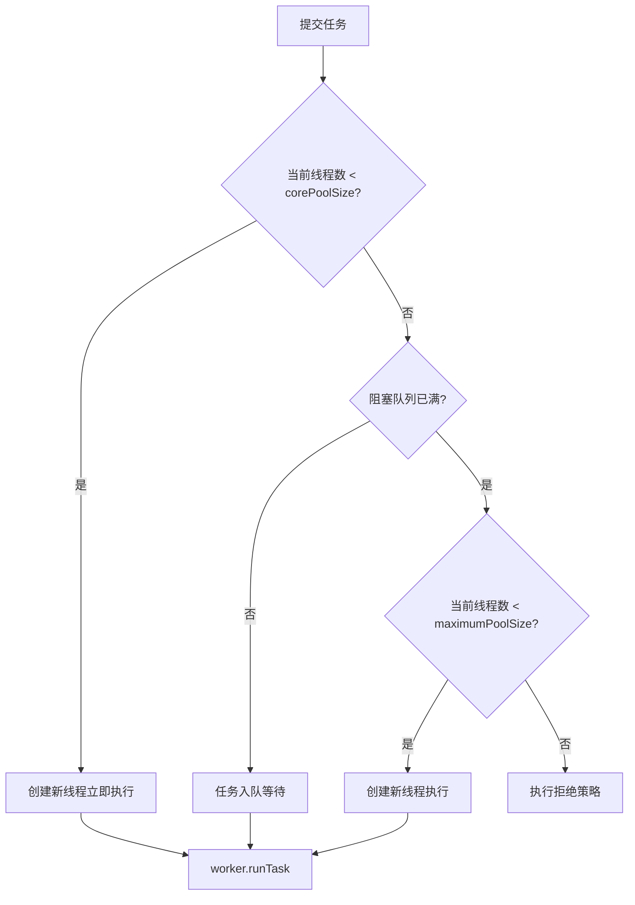
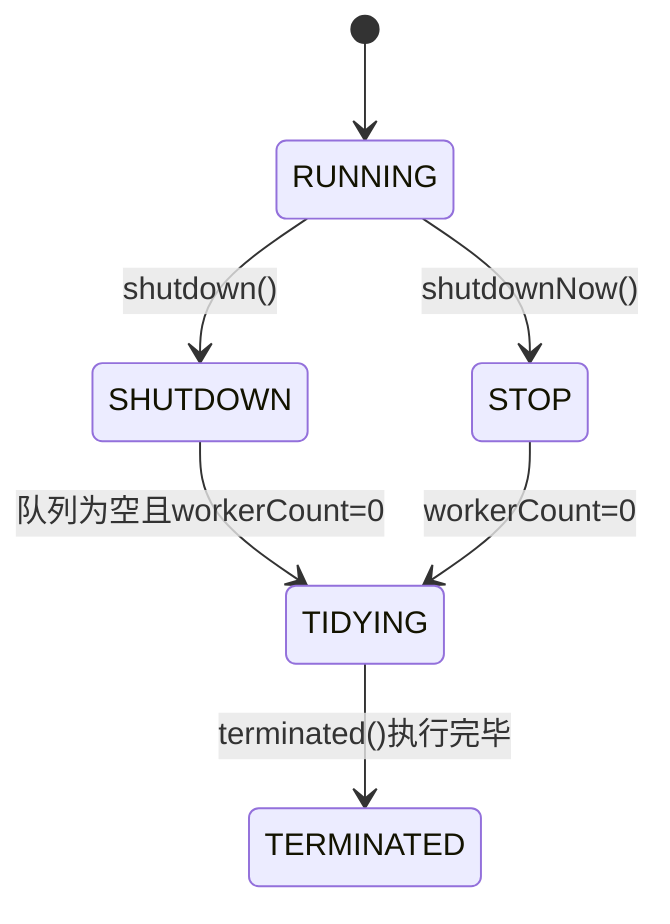

# ThreadPoolExecutor 源码拆解：从位运算到拒绝策略的完整链路

## 引言

想象一下，你经营一家餐厅。高峰期客人络绎不绝，你不可能每来一个客人就临时去招聘一个服务员——这就是**池化思想**的由来。在 Java 生态中，线程池就是这家"餐厅"，核心线程是"正式员工"，阻塞队列是"等位区"，最大线程是"临时工上限"，而拒绝策略决定了"客满之后该怎么办"。

然而，**阿里 Java 开发规约**明确要求：**必须手动创建线程池，禁止使用 Executors 工厂类**。为什么？因为 `Executors.newFixedThreadPool` 用了无界队列，会在极端情况撑爆内存。今天我们就从源码层次，把线程池的每一个关键设计讲透。

> 本文基于 **Java 17** 源码分析，核心逻辑与 Java 8/11/21 一致。

## 核心概念：餐厅模型

在深入源码之前，先用一张图建立直觉：



这就像一个餐厅：正式员工不够用 → 让客人在等位区排队 → 等位区满了 → 临时招人（直到上限） → 实在不行就拒绝接待。

## 源码分析：三个核心设计

### 1. ctl 字段：一个 AtomicInteger 的双重身份

`ThreadPoolExecutor` 最精妙的设计是 `ctl` 字段——**用一个 AtomicInteger 同时存储线程池状态和工作线程数量**：

```java
public class ThreadPoolExecutor extends AbstractExecutorService {
    // ctl 是一个 AtomicInteger：高3位存状态，低29位存线程数
    private final AtomicInteger ctl = new AtomicInteger(ctlOf(RUNNING, 0));
    
    // Integer.SIZE = 32，COUNT_BITS = 29
    private static final int COUNT_BITS = Integer.SIZE - 3;
    
    // CAPACITY = 00011111...111 (低29位全1，约5.37亿)
    private static final int CAPACITY   = (1 << COUNT_BITS) - 1;
    
    // 5种状态（高3位表示）：
    // RUNNING    = 11100000...000 (可以接受新任务 & 处理队列中的任务)
    // SHUTDOWN   = 00000000...000 (不接受新任务，但处理队列中的任务)
    // STOP       = 00100000...000 (不接受新任务，不处理队列中的任务，中断正在执行的任务)
    // TIDYING    = 01000000...000 (所有任务已终止，workerCount=0，准备调用 terminated())
    // TERMINATED = 01100000...000 (terminated() 已执行完毕)
    private static final int RUNNING    = -1 << COUNT_BITS;
    private static final int SHUTDOWN   =  0 << COUNT_BITS;
    private static final int STOP       =  1 << COUNT_BITS;
    private static final int TIDYING    =  2 << COUNT_BITS;
    private static final int TERMINATED =  3 << COUNT_BITS;
    
    // 从 ctl 中提取/操作数据
    private static int runStateOf(int c)     { return c & ~CAPACITY; }
    private static int workerCountOf(int c)  { return c & CAPACITY; }
    private static int ctlOf(int rs, int wc) { return rs | wc; }
}
```

**为什么这样做？** 两个理由：

1. **CAS 原子性**：对状态和数量的修改可以通过一次 CAS 原子完成，避免了两步操作的竞态条件
2. **内存效率**：一个 int（4字节）替代两个独立变量，减少缓存行占用

**状态流转图：**



### 2. execute() 方法：三步走的精妙逻辑

`execute()` 是入口方法，让我们逐行分析：

```java
public void execute(Runnable command) {
    if (command == null)
        throw new NullPointerException();
    
    int c = ctl.get();
    
    // 第一步：如果 worker 数少于核心线程数，尝试直接 addWorker
    if (workerCountOf(c) < corePoolSize) {
        if (addWorker(command, true))  // true = 使用 corePoolSize 作为上限
            return;
        c = ctl.get();  // 添加失败（可能状态变了或并发竞争），重新读取
    }
    
    // 第二步：尝试将任务放入阻塞队列
    if (isRunning(c) && workQueue.offer(command)) {
        int recheck = ctl.get();
        // 双重检查：入队后线程池可能已经 shutdown，需要回滚
        if (!isRunning(recheck) && remove(command))
            reject(command);
        // 或者 worker 全部死亡，需要新建一个
        else if (workerCountOf(recheck) == 0)
            addWorker(null, false);  // 创建一个空 worker 来处理队列中的任务
    }
    
    // 第三步：队列满了，尝试突破核心线程数创建新线程
    else if (!addWorker(command, false))  // false = 使用 maximumPoolSize 作为上限
        reject(command);  // 达到最大线程数，执行拒绝策略
}
```

**关键细节**：第二步的双重检查（double-check）非常关键。考虑这个场景：

1. 线程池在 RUNNING 状态，`workQueue.offer()` 成功入队
2. 就在这一瞬间，外部调用 `shutdown()` 
3. 如果不做 recheck，这个刚入队的任务永远不会被执行（因为 shutdown 后不会有新 worker 来拉取任务）

这个**并发窗口**极其短暂，但 `execute()` 仍然做了防御。这就是 Doug Lea 的编码功力。

### 3. Worker 类：AQS 实现的可重入独占锁

每个工作线程封装在一个 `Worker` 对象中。Worker 继承 `AbstractQueuedSynchronizer`，实现了一个**不可重入的独占锁**：

```java
private final class Worker extends AbstractQueuedSynchronizer implements Runnable {
    private static final long serialVersionUID = 6138294804551838833L;
    
    final Thread thread;  // 真正执行任务的线程
    Runnable firstTask;   // 创建时的第一个任务，可为 null
    volatile long completedTasks;  // 该 worker 已完成的任务计数
    
    Worker(Runnable firstTask) {
        setState(-1);  // 抑制中断，直到线程启动
        this.firstTask = firstTask;
        this.thread = getThreadFactory().newThread(this);
    }
    
    // AQS 核心：state=0 表示未锁定，state=1 表示已锁定
    protected boolean isHeldExclusively() { return getState() != 0; }
    protected boolean tryAcquire(int unused) {
        if (compareAndSetState(0, 1)) {
            setExclusiveOwnerThread(Thread.currentThread());
            return true;
        }
        return false;
    }
    protected boolean tryRelease(int unused) {
        setExclusiveOwnerThread(null);
        setState(0);
        return true;
    }
    
    public void lock()        { acquire(1); }
    public boolean tryLock()  { return tryAcquire(1); }
    public void unlock()      { release(1); }
    public boolean isLocked() { return isHeldExclusively(); }
}
```

**Worker 用 AQS 实现锁的三个目的：**

1. **判断线程是否空闲**：`tryLock()` 成功 = Worker 空闲，可用于分配新任务
2. **安全中断**：`interruptIdleWorkers()` 只中断能获取锁的 Worker（即空闲的），正在执行任务的 Worker 不受影响
3. **防止并发中断**：`shutdown()` 和 `shutdownNow()` 在中断线程前需要先获取锁

`runWorker()` 方法是 Worker 的核心循环：

```java
final void runWorker(Worker w) {
    Thread wt = Thread.currentThread();
    Runnable task = w.firstTask;
    w.firstTask = null;
    w.unlock();  // 允许中断（构造函数中 state=-1 阻止了中断）
    boolean completedAbruptly = true;
    try {
        // 核心循环：getTask() 从队列拉取任务
        while (task != null || (task = getTask()) != null) {
            w.lock();
            // 如果线程池状态 >= STOP，确保线程是中断状态
            // 如果线程池状态 < STOP，确保线程不是中断状态（清除中断标记）
            if ((runStateAtLeast(ctl.get(), STOP) ||
                 (Thread.interrupted() && runStateAtLeast(ctl.get(), STOP))) &&
                !wt.isInterrupted())
                wt.interrupt();
            try {
                beforeExecute(wt, task);  // 钩子方法
                try {
                    task.run();           // 真正执行任务
                } catch (Throwable ex) {
                    afterExecute(task, ex);  // 钩子方法（异常处理）
                    throw ex;
                }
                afterExecute(task, null);    // 钩子方法（正常完成）
            } finally {
                task = null;
                w.completedTasks++;
                w.unlock();
            }
        }
        completedAbruptly = false;  // 正常退出（getTask 返回 null）
    } finally {
        processWorkerExit(w, completedAbruptly);
    }
}
```

## 实战代码：三个进阶用法

### 示例1：监控型线程池（包装 ThreadPoolExecutor）

```java
public class MonitoredThreadPool extends ThreadPoolExecutor {
    
    private final ThreadLocal<Long> startTime = new ThreadLocal<>();
    private final AtomicLong totalTaskTime = new AtomicLong();
    private final AtomicLong taskCount = new AtomicLong();
    
    public MonitoredThreadPool(int core, int max, long keepAlive, TimeUnit unit,
                                BlockingQueue<Runnable> workQueue, ThreadFactory factory,
                                RejectedExecutionHandler handler) {
        super(core, max, keepAlive, unit, workQueue, factory, handler);
    }
    
    @Override
    protected void beforeExecute(Thread t, Runnable r) {
        startTime.set(System.nanoTime());
        super.beforeExecute(t, r);
    }
    
    @Override
    protected void afterExecute(Runnable r, Throwable t) {
        long duration = System.nanoTime() - startTime.get();
        totalTaskTime.addAndGet(duration);
        taskCount.incrementAndGet();
        startTime.remove();
        
        if (t != null) {
            System.err.printf("[ALERT] 任务异常: %s, 耗时: %.2fms%n", 
                t.getMessage(), duration / 1_000_000.0);
        }
        super.afterExecute(r, t);
    }
    
    public double getAverageTaskTimeMs() {
        long count = taskCount.get();
        return count == 0 ? 0 : totalTaskTime.get() / (double) count / 1_000_000.0;
    }
    
    public Map<String, Object> getMetrics() {
        return Map.of(
            "activeCount", getActiveCount(),
            "poolSize", getPoolSize(),
            "corePoolSize", getCorePoolSize(),
            "maxPoolSize", getMaximumPoolSize(),
            "queueSize", getQueue().size(),
            "completedTaskCount", getCompletedTaskCount(),
            "avgTaskTimeMs", String.format("%.2f", getAverageTaskTimeMs())
        );
    }
}
```

### 示例2：自定义拒绝策略——"降级重试"

```java
public class DegradeAndRetryPolicy implements RejectedExecutionHandler {
    
    private final int maxRetries;
    private final long backoffMs;
    
    public DegradeAndRetryPolicy(int maxRetries, long backoffMs) {
        this.maxRetries = maxRetries;
        this.backoffMs = backoffMs;
    }
    
    @Override
    public void rejectedExecution(Runnable r, ThreadPoolExecutor executor) {
        if (!executor.isShutdown()) {
            for (int i = 0; i < maxRetries; i++) {
                try {
                    Thread.sleep(backoffMs * (i + 1));  // 递增退避
                    if (executor.getQueue().offer(r, 500, TimeUnit.MILLISECONDS)) {
                        System.out.printf("[RETRY] 重试成功，第%d次\n", i + 1);
                        return;
                    }
                } catch (InterruptedException e) {
                    Thread.currentThread().interrupt();
                    break;
                }
            }
        }
        // 最终兜底：记录到数据库或消息队列，供后续补偿处理
        System.err.printf("[FALLBACK] 任务 %s 降级到持久化存储\n", r.toString());
        saveToDeadLetterQueue(r);
    }
    
    private void saveToDeadLetterQueue(Runnable task) {
        // 实际项目中写入数据库或 Kafka 死信队列
    }
}
```

### 示例3：动态调整线程池参数

```java
public class DynamicThreadPoolManager {
    
    private final ThreadPoolExecutor executor;
    private final ScheduledExecutorService scheduler = Executors.newSingleThreadScheduledExecutor();
    
    public DynamicThreadPoolManager(ThreadPoolExecutor executor) {
        this.executor = executor;
        // 每 10 秒采集一次指标
        scheduler.scheduleAtFixedRate(this::adjustPoolSize, 10, 10, TimeUnit.SECONDS);
    }
    
    private void adjustPoolSize() {
        int queueSize = executor.getQueue().size();
        int activeCount = executor.getActiveCount();
        int coreSize = executor.getCorePoolSize();
        int maxSize = executor.getMaximumPoolSize();
        
        // 策略1：队列持续堆积 → 扩容核心线程
        if (queueSize > 100 && activeCount >= coreSize && coreSize < maxSize) {
            int newCore = Math.min(coreSize + 2, maxSize);
            executor.setCorePoolSize(newCore);
            System.out.printf("[SCALE_UP] core: %d → %d, queue: %d%n", 
                coreSize, newCore, queueSize);
        }
        
        // 策略2：线程持续空闲 → 缩容
        if (queueSize < 10 && activeCount < coreSize / 2 && coreSize > 1) {
            int newCore = Math.max(coreSize - 1, 1);
            executor.setCorePoolSize(newCore);
            System.out.printf("[SCALE_DOWN] core: %d → %d, active: %d%n", 
                coreSize, newCore, activeCount);
        }
    }
    
    public void shutdown() {
        scheduler.shutdown();
        executor.shutdown();
    }
}
```

## 方案对比：Executors 工厂方法的陷阱

| 工厂方法 | 队列类型 | 队列容量 | 风险 |
|---------|---------|---------|------|
| `newFixedThreadPool(n)` | LinkedBlockingQueue | **Integer.MAX_VALUE** | 队列无限增长 → OOM |
| `newCachedThreadPool()` | SynchronousQueue | 0 | 线程数无限增长 → OOM（线程栈内存） |
| `newSingleThreadExecutor()` | LinkedBlockingQueue | **Integer.MAX_VALUE** | 同 FixedThreadPool |
| `newScheduledThreadPool(n)` | DelayedWorkQueue | **Integer.MAX_VALUE** | 同上 |

**核心问题**：`Executors` 把"方便"建立在了"无界"之上，而"无界"在生产环境中就是一颗定时炸弹。

## 最佳实践与避坑指南

### ✅ 推荐做法

1. **显式构造线程池**，所有参数了然于胸：
```java
ThreadPoolExecutor executor = new ThreadPoolExecutor(
    5,                          // corePoolSize（根据 CPU 密集/IO 密集调整）
    10,                         // maximumPoolSize
    60L, TimeUnit.SECONDS,      // 空闲线程存活时间
    new LinkedBlockingQueue<>(200),  // 有界队列！有界队列！有界队列！
    new ThreadFactoryBuilder().setNameFormat("biz-pool-%d").build(),  // 命名！
    new ThreadPoolExecutor.CallerRunsPolicy()  // 明确的拒绝策略
);
```

2. **核心线程数计算公式**：
   - CPU 密集型：`N+1`（N = CPU 核数）
   - IO 密集型：`N * 2` 或 `N * (1 + WT/ST)`（WT=等待时间，ST=计算时间）
   - 混合型：拆分为两个独立线程池分别处理

3. **必须给线程命名**（出问题时你能快速定位）：
```java
ThreadFactory namedFactory = new ThreadFactoryBuilder()
    .setNameFormat("order-processor-%d")
    .setUncaughtExceptionHandler((t, e) -> 
        log.error("线程 {} 异常退出", t.getName(), e))
    .build();
```

### ❌ 常见陷阱

1. **用 `submit()` 提交任务但忽略 `Future.get()` 返回**：如果 `submit()` 的 `Runnable` 抛出异常，异常会被吞掉。要么用 `execute()`，要么检查 `Future.get()`
2. **shutdown() vs shutdownNow() 混淆**：`shutdown()` 等队列任务执行完，`shutdownNow()` 直接中断并返回未执行任务列表
3. **线程池隔离不够**：一个慢查询可能拖死整个池。核心业务和非核心业务使用**独立线程池**
4. **在 Tomcat 等容器线程池中 fork 子任务再用 `.get()` 阻塞**：可能造成线程饥饿死锁

## 总结

`ThreadPoolExecutor` 是 Java 并发编程中最常用的组件之一，但也是最容易被误用的。三个要点：

1. **ctl 的位运算设计**是用空间换安全，一个 CAS 操作就能原子地修改状态和计数
2. **三步走的 execute()** 方法用双重检查解决了入队和 shutdown 之间的并发竞态
3. **Worker 的 AQS 锁**巧妙地同时完成了"标记忙碌"和"安全中断"两个职责

理解这些设计原理之后，你在遇到线程池拒绝异常、任务堆积、内存溢出等问题时，就能快速定位根因而非盲目调参。

**思考题**：如果让你用 Java 21 的虚拟线程（Virtual Thread）重新设计线程池，`getTask()` 中阻塞队列的 `poll(keepAliveTime, TimeUnit)` 是否可以去掉？为什么？欢迎在评论区讨论。
